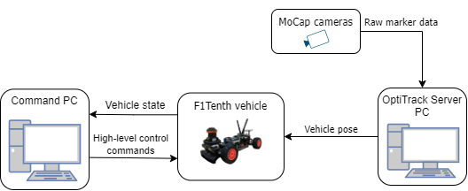

# Hardware architecture

The hardware architecture of AIMotionLab consists of three main components that are required by the f1fleet_r2 framework.

## OptiTrack motion capture system

The OptiTrack system is needed for the localization of the F1TENTH vehicles. The high-precision motion capture cameras are connected to the OptiTrack server PC, which is responsible for broadcasting the position and the orientation of the tracked vehicles over the local network.

## Command PC

The computer running the f1tenthh_r2 package. Since the package is built around ROS2 Foxy, Ubuntu 20.04 OS is required.

## F1TENTH vehicle(s)

F1TENTH is a 1/10 scale autonomous vehicle developed and maintained by the F1TENTH community. It is an open-source platform to aid autonomous systems research and education. To use f1tenth_r2, fully built and configured F1TENTH vehicles with Ubuntu 20.04 and ROS2 Foxy installed are necessary. Build documentation is available [here](https://f1tenth.org/build.html).

---

**_Note_** The official F1TENTH Driver Stack is not required, since the f1tenth_r2 package will install its own onboard software.

---
