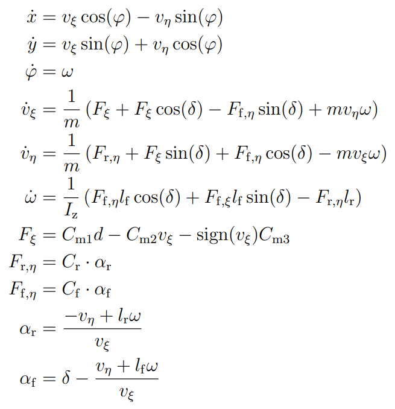
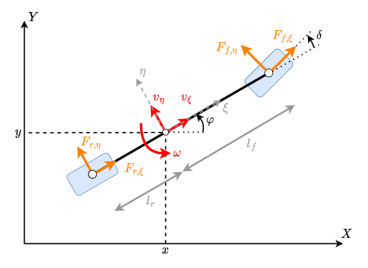
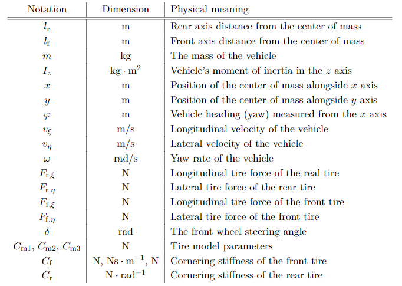

# Dynamic model of the F1TENTH vehicle

The F1TENTH vehicles of the lab have been modeled as a dynamic single-track model, complemented with a linear tire model and a custom drivetrain model. The model is described by the following equations:

Where the model parameters are:

Further information about the construction of the model and estimation of the parameters can be found in [Kristóf Floch. “Model-based motion control of the F1TENTH autonomous electrical vehicle”. BSc Thesis. Budapest University of Technology of Economics, 2022.](https://sztakimtahu-my.sharepoint.com/personal/flochkristof_sztaki_hu/_layouts/15/onedrive.aspx?id=%2Fpersonal%2Fflochkristof%5Fsztaki%5Fhu%2FDocuments%2FPublications%2Fkfloch%5Fthesis%2Epdf&parent=%2Fpersonal%2Fflochkristof%5Fsztaki%5Fhu%2FDocuments%2FPublications&ga=1)

## Path-following control

Based on the obtained vehicle model, a discrete-time LPV-LQR controller has been designed for the cars, that provide accurate trajectory tracking. The implementations of the control algorithms are located in the f1tenth_r2/f1_car/src/vehicle_control directory. The theoretical background of the path following control is also outlined in the reviously mentioned BSc thesis.